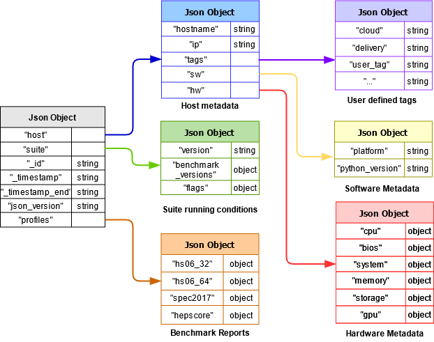

# IO Benchmark Suite

- [IO Benchmark Suite](#io-benchmark-suite)
  * [About](#about)
  * [Examples](#examples)
  * [Benchmark suite architecture](#benchmark-suite-architecture)
    + [Integration status](#integration-status)
    + [Available benchmarks](#available-benchmarks)
    + [Example of Benchmark Suite workflow](#example-of-benchmark-suite-workflow)
  * [Installation](#installation)
    + [Local user space](#local-user-space)
    + [Python virtual environments (minimum footprint)](#python-virtual-environments--minimum-footprint-)
  * [How to run](#how-to-run)
  * [Plugins](#plugins)
    + [Hardware metadata](#hardware-metadata)
    + [Advanced Message Queuing (AMQ)](#advanced-message-queuing--amq-)
  * [Description of all arguments](#description-of-all-arguments)
    + [Typical use cases](#typical-use-cases)

## About

The IO Benchmark Suite is a python module which orchestrates a set of benchmarks, collects their results as well as machine metadata, and produces a summary JSON report.

It is forked from the [HEP-Benchmark-Suite](https://gitlab.cern.ch/hep-benchmarks/hep-benchmark-suite), and follows the same approach in hopes of maintaining future compatibility. 

:warning: What follows is largely inherited from the upstream project, and may not be accurate as development progresses!


---


The suite is a modular approach to target the following use cases in HEP computing:

1. **Allow collection of a configurable number of benchmarks**
   * Enable performance studies on heterogeneous hardware.
1. **Collect the hardware metadata and the running conditions**
   * Compare the benchmark outcome under similar conditions.
1. **Have prompt feedback about executed benchmarks**
   * By publishing results to a monitoring system.
1. **Probe randomly assigned slots in a cloud environment**
   * In production can suggest deletion and re-provisioning of underperforming resources.

## Examples

TODO

## Benchmark suite architecture

*The figure shows the high level architecture of the benchmark suite.*

<div align="center">
  
</div>

A configurable sequence of benchmarks may be launched by the IO Benchmark Suite.

Benchmark results are aggregated into a single JSON document, together with the hardware metadata (CPU model, host name, Data Centre name, kernel version, etc.)

Optionally, the final report can be sent to a transport layer, to be further digested and analysed by broker consumers.

Users may also execute the suite in stand-alone mode without result reporting -  see [How to run](#how-to-run) for further details.

### Integration status

The current IO Benchmark Suite integration status.

* Benchmarks

Benchmark | Docker             | Singularity
:---:     | :---:              | :---:
fIO       | :x: | :x:
IoR       | :x: | :x:
CMSSW     | :x: | :x:

* Plugins

Plugin        | Status |
:---:         | :--:               |
HW-Metadata   | :heavy_check_mark: |
ActiveMQ      | :heavy_check_mark: |
Elastic Search|:x:        |

### Available benchmarks

The IO Benchmark Suite is delivered **ready-to-run** with a [default yaml](iobenchmarksuite/config/benchmarks.yml) configuration file (see [How to run](#how-to-run)). The  currently available benchmarks are:

* TODO

### Example of Benchmark Suite workflow

<div align="center">
  
</div>

*The above figure shows an example adoption of the Benchmark suite for a multi-partition deployment.*

Servers belonging to different data centres (or cloud providers) are benchmarked by executing the IO Benchmark Suite in each of them. The mentioned servers can be *bare metal* servers as well as *virtual machines*. After running, the final JSON report is published to an AMQ message broker (*shown as transport layer above*).

In this example, an AMQ consumer may then digest the messages from the broker, and insert them in an Elasticsearch cluster so that the benchmark results can be aggregated and visualized in dashboards. Metadata (such as UID, CPU architecture, OS, Cloud name, IP address, etc.) are also included into the searchable results.

Users are free to build/use transport and aggregation/visualization tools of their choice to ingest the generated JSON results.

## Installation

> **This package requires `pip3` >= 19.1, `python3.6+` and `git`**\
  If your `pip3 --version` is older, please update with: `pip3 install --user --upgrade pip` before installing!

### Local user space

```sh
python3 -m pip install --user git+https://github.com/dcsouthwick/iobmk.git
```

This will install the suite to the user's home directory:

```sh
~/.local/bin/iobmk
```

You can additionally add the executible to you $PATH:

```sh
export PATH=$PATH:~/.local/bin
```

### Python virtual environments (minimum footprint)

There are cases on which the user would like to keep current Python3 library versions and have a minimum footprint of newly installed packages. For such purporses, it is possible to install the `IO-benchmark-suite` using [Python Virtual Environments](https://docs.python.org/3/tutorial/venv.html). This is the desired approach when the user requires a minimum footprint on the system.

```sh
export MYENV="bmk_env"        # Define the name of the environment.
python3 -m venv $MYENV        # Create a directory with the virtual environment.
source $MYENV/bin/activate    # Activate the environment.
python3 -m pip install git+https://github.com/dcsouthwick/iobmk.git
```

## How to run

> TODO: Outdated

The python executable `bmkrun` can be added to the user's `$PATH`, and launched directly. The `bmkrun` requires one argument to be able to execute:  `--config`.
Users are free to provide [command-line arguments](#description-of-all-arguments), or edit the [`benchmarks.yml`](hepbenchmarksuite/config/benchmarks.yml) file directly.

* Running the HEP Benchmark Suite with default configuration (hepscore is the default benchmark)
  ```
  iobmk -c default
  ```

* Execute with an alternative configuration
  ```
  iobmk -c <config path>
  ```

Points of attention:

- **All CLI arguments have override effect.** For instance, if user has defined multiple benchmarks on the configuration file and specify only one with the `--benchmarks` option, only this benchmark will be executed.

- The aggregated results of the selected benchmarks are written to the location defined by the `--rundir=` argument or `rundir` in the `yaml` file.

- By default, results are not sent via AMQ. To send the results, please refer to [Advanced Message Queuing (AMQ)](#Advanced-Message-Queuing-(AMQ)) section.

- Benchmarks are executed in sequence.

- ~~The following benchmarks: `hepscore`, `hepspec06`, `spec2017` are configured in their appropriate configuration sections.~~

- ~~In the case of running HS06, and/or SPEC CPU2017, the benchmark will look for the installation at the specified `hepspec_volume:`, and if it does not exist, it will attempt to install it via tarball argument `url_tarball:`, as defined in the [`benchmarks.yml`](iobenchmarksuite/config/benchmarks.yml)).~~

- Please have a look at the [Examples](#examples) section.

## Plugins

### Hardware metadata

The suite ships with a [hardware metadata plugin](iobenchmarksuite/plugins/extractor.py) which is responsible to collect system hardware and software information. This data is then compiled and reported in the results json file.

This plugin relies on system tools such as: `lscpu`, `lshw`, `dmidecode`. Some of these tools require escalated priviledges for a complete output. Please take this into consideration if some outputs are empty in the final json report.

<div align="center">
  
</div>


### Advanced Message Queuing (AMQ)

AMQ publishing is implemented using the [STOMP protocol](https://stomp.github.io/). Users must provide either a valid username/password or key/cert pair, in addition to the server and topic. The relevant section of the [config yaml](iobenchmarksuite/config/benchmarks.yml) is given below. You can then pass the argument `--publish` to the suite.

**1. username/password settings**
```yaml
activemq:
  server: dashb-mb.cern.ch
  topic: /topic/vm.spec
  username: user
  password: secret
  port: 61113
```

**2. user cert settings**
```yaml
activemq:
  server: dashb-mb.cern.ch
  topic: /topic/vm.spec
  key: /path/key-file.key
  cert: /path/cert-file.pem
  port: 61123
```

In order to publish to the dedicated CERN AMQ broker, the authentication with key/cert pair is preferred.
The user DN needs to be whitelisted in the broker configuration. Please extract the user DN in this format

```
openssl x509 -noout -in usercert.pem -subject -nameopt RFC2253
```
 
Additional information on user certificate can be found at the official CA documentation https://ca.cern.ch/ca/Help/?kbid=024010

## Description of all arguments

The `-h` option provides an explanation of all command line arguments

```none
$ iobmk --help
-----------------------------------------------
High Energy Physics Benchmark Suite
-----------------------------------------------
This utility orchestrates several benchmarks

Author: Benchmarking Working Group
Contact: benchmark-suite-wg-devel@cern.ch

optional arguments:
  -h, --help            Show this help message and exit
  -b, --benchmarks BENCHMARKS [BENCHMARKS ...]
                        List of benchmarks
  -c, --config [CONFIG]
                        Configuration file to use (yaml format)
  -d, --rundir [RUNDIR]
                        Directory where benchmarks will be run
  -e, --export          Export all json and log files from rundir and
                        compresses them.
  -m, --mode [{singularity,docker}]
                        Run benchmarks in singularity or docker containers.
  -n, --mp_num [MP_NUM] Number of cpus to run the benchmarks.
  -t, --tags            Enable reading of user tags from ENV variables
                        (BMKSUITE_TAG_{TAG}). Tags specified in configuration
                        file are ignored.
  -p, --publish         Enable reporting via AMQ credentials in YAML file.
  -s, --show            Show running config and exit.
  -v, --verbose         Enables verbose mode. Display debug messages.
  --version             Show program's version number and exit
-----------------------------------------------
```

### Typical use cases


- Show default configuration.

    ```sh
    iobmk -c default --show
    ```

- Specify custom tags via ENV variables.

    ```sh
    # All tags should start with BMKSUITE_TAG_
    export BMKSUITE_TAG_MYTAG="My custom tag"
    export BMKSUITE_TAG_SECONDTAG=$(uptime)

    # The --tags flag enables the reading of ENV variables
    # ignores tags specified in config file
    bmkrun -c default --tags
    ```

- Run a test bencharmk DB12 (should not be used for system benchmarking)

    ```sh
    bmkrun -c default -b db12
    ```

- Run HS06 and SPEC2017 (Alternate config should be based on [`benchmarks.yml`](iobenchmarksuite/config/benchmarks.yml))

    ```sh
    bmkrun -c <alternate config>  -b hs06_32 spec2017
    ```

