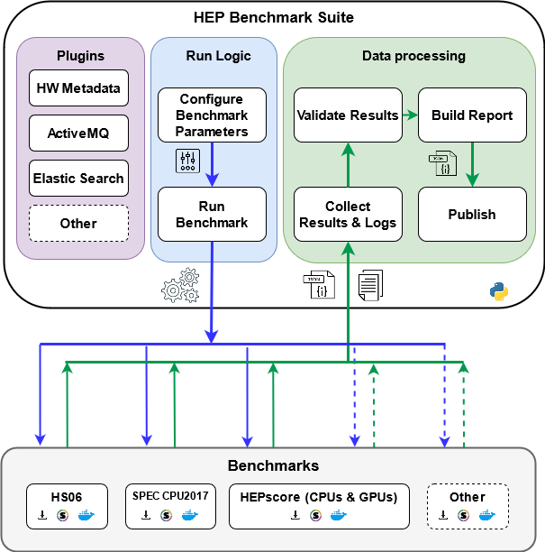
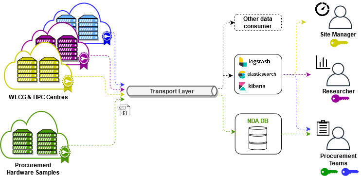

# HEP Benchmark Suite

| Branch |  QA | Master |
| -------- | -------- | -------- |
|     |  [](https://gitlab.cern.ch/hep-benchmarks/hep-benchmark-suite/commits/qa)     |  [](https://gitlab.cern.ch/hep-benchmarks/hep-benchmark-suite/commits/master)     |


The HEP Benchmark Suite is a toolkit which aggregates several different benchmarks
in one single application.

It is built to comply with several use cases by allowing the users to specify
which benchmarks to run.

## Goals
1. Mimic the usage of WLCG resources for experiment workloads
   * Run representative benchmarks on VMs of the same size used by VOs
1. Allow collection of a configurable number of benchmarks
   * Compare the benchmark outcome under similar conditions  
1. Probe randomly assigned slots in a cloud cluster
   * Not knowing what the neighbor is doing
1. Have a prompt feedback about executed benchmarks
   * In production can suggest deletion and re-provisioning of underperforming VMs


## Benchmark suite architecture




The figure shows the high level architecture of the benchmark suite. 

A configurable sequence of benchmarks is executed by the HEP Benchmark Suite.

After execution of all benchmarks, the benchmark results are aggregated in a single JSON document 
together with the hardware metadata (CPU model, host name, Data Centre name, kernel version, etc).

Optionally, the final report can be sent to a transport layer, to be further digested and analysed
by applications that are subscribed as consumer to the transport layer.

Users can also choose not to send the benchmark results out from the running machine, 
just by configuring the offline mode (see [How to run](#how-to-run) for further details).

### Available benchmarks
The  currently available benchmarks are 
- HEP-score ([link](https://gitlab.cern.ch/hep-benchmarks/hep-score))
- HS06 ([link](https://w3.hepix.org/benchmarking.html))
- SPEC CPU2017 ([link](https://www.spec.org/cpu2017/)) 
- some fast benchmarks: 
    - DIRAC Benchmark
    - ATLAS Kit Validation

In addition the *Hyper-benchmark* configuration enables a sequence of fast benchmarks and load measurements as follow:
_**1-min Load -> read machine&job features -> DB12 -> 1-min Load -> 1-min Load**_


The HEP Benchmark Suite expects the user to pass the list of benchmarks to be executed (see [How to run](#how-to-run) ).

### Example of a multi-cloud deployment of HEP Benchmark Suite measurements



The above figure shows a typical adoption of the HEP Benchmark suite for a multi-cloud profiling.
Servers belonging to different Data Centres (or cloud providers)
are benchmarked deploying the HEP Benchmark Suite in each of them. 
After running, the final JSON report is 
published into a AMQ message broker (transport layer).

A dedicated consumer digests those messages and inserts them 
in an Elasticsearch cluster, so that the benchmark results can be visualized and
aggregated in dashboards. Several metadata (such as UID, CPU architecture,
OS, Cloud name, IP address, etc.) are included in the result message in order to
enable aggregations.

The data
storage, analysis and visualization layers in the image above are purely exemplifications, as users
can opt to build/use their own transport and storage tools.  

The mentioned servers can be *bare metal* servers as well as *virtual machines*.
As mentioned in another section, due to proprietary license aspects, HS06 and SPEC CPU 2017 need to be pre-installed on the server.
For what concerns HEP-score, just the availability of docker installation is required.

## How to run

### Installation

The preferred running mode is using a distributed docker image for the suite
#### Docker container (Preferred mode)

The hep-benchmark-suite is distributed in a Cern Centos 7 image (`gitlab-registry.cern.ch/hep-benchmarks/hep-benchmark-suite/hep-benchmark-suite-cc7:latest`)

Some of the workloads also run in standalone containers (e.g. the hep-workloads included in the HEPscore )
In order to enable `docker run` from the running container, the bind mount of the `/var/run/docker.sock` and run in priviledged mode as follow
```
DOCKSOCK=/var/run/docker.sock
BMK_SUITE_IMAGE=gitlab-registry.cern.ch/hep-benchmarks/hep-benchmark-suite/hep-benchmark-suite-cc7:latest

docker run --rm  --privileged --net=host -h $HOSTNAME \
              -v /tmp:/tmp -v /var/HEPSPEC:/var/HEPSPEC -v $DOCKSOCK:$DOCKSOCK \
              $BMK_SUITE_IMAGE hep-benchmark-suite $NEEDED_ARGUMENTS 
```


#### Install the suite

The suite is currently supported for Cern CentOS 7 (CC7) OS.
In a CC7 machine, download the latest tagged version of this gitlab repository and run
`make all` in order to install locally all needed packages


### Running

In order to run a sequence of benchmarks, specify the list using the `--benchmarks` argument.

In the following example all benchmarks are running. 
In the example HS06 and SPEC CPU2 017 are expected to be already installed in `/var/HEPSPEC`. 
In case the packages are in another path, change the corresponding entries. 

```
ARGUMENTS="--cloud=$CLOUD --hs06_path=/var/HEPSPEC --hs06_iter=1  --spec2017_path=/var/HEPSPEC --spec2017_iter=1 --hepscore_conf=/tmp/hepscore_test.yml"
AMQ_ARGUMENTS="--queue_host=**** --queue_port=**** --username=**** --password=**** --topic=**** "
ADDITIONAL_ARGUMENTS="--vo=<an aggregate>  --freetext=<a tag text> --pnode=<physical node name>  -d"

hep-benchmark-suite --benchmarks="DB12;kv;hepscore;hs06_32;hs06_64;spec2017" $ARGUMENTS $ADDITIONAL_ARGUMENTS $AMQ_ARGUMENTS
```
The additional arguments are not mandatory. 

If publication in a destination AMQ broker is not needed, replace `AMQ_ARGUMENTS=" -o "` to run offline.

### Get Description of all arguments

The `-h` option provides an explanation of all command line arguments

```
hep-benchmark-suite -h

Usage:
 $0 [OPTIONS]

OPTIONS:
-d	 debug verbosity
-q	 Quiet mode. Do not prompt user
-o	 Offline mode. Do not publish results. If not used, the script expects the publishing parameters
--benchmarks=<bmk1;bmk2>
	 (REQUIRED) Semi-colon separated list of benchmarks to run. Available benchmarks are:
		 - hs06_32 (for 32 bits)
		 - hs06_64 (for 64 bits)
		 - spec2017
		 - hepscore
		 - kv
		 - DB12
		 - hyper-benchmark (*)
--mp_num=#
	 Number of concurrent processes (usually cores) to run. If not used, mp_num = cpu_num
--uid=<id>
	 (Optional) Unique identifier for the host running this script. If not specified, it will be generated
--public_ip=<ip>
	 (Optional) Public IP address of the host running this script. If not specified, it will be generated
--cloud=<cloudName>
	 Cloud name to identify the results - if not specified, CLOUD=test and use -q to avoid prompt
--vo=<VO>
	 (Optional) Name of the VO responsible for the underlying resource
--pnode=<physicalNode>
	 (Optional) Name of the hypervisor machine hosting the VM
--queue_port=<portNumber>
	 Port number of the ActiveMQ broker where to send the benchmarking results
--queue_host=<hostname>
	 Hostname with the ActiveMQ broker where to send the benchmarking results
--username=<username>
	 Username to access the ActiveMQ broker where to send the benchmarking results
--password=<password>
	 User password to access ActiveMQ broker where to send the benchmarking results
--amq_key=<path_to_key>
	 Key file for the AMQ authentication, without passphrase. Expects --amq_cert
--amq_cert=<path_to_cert>
	 Certificate for the AMQ authentication. Expects --amq_key
--topic=<topicName>
	 Topic (or Queue) name used in the ActiveMQ broker
--freetext=<string>
	 (Optional) Any additional free text to add to the generated output JSON
	 (*) this benchmark performs the following measurements sequence: 1-min Load -> read machine&job features -> DB12 -> 1-min Load -
--hs06_path=<string>
	 MANDATORY: Path where the HEPSPEC06 installation is expected
--hs06_url=<string>
	 url where the HEPSPEC06 tarball is expected to be downloaded. The tarball is then unpacked into hs06_path
--hs06_bmk=<string>
	 the hs06 benchmark otherwise the default (all_cpp) is used. Example --hs06_bmk=453.povray
--hs06_iter=<string>
	 the hs06 number of iterations for each benchmark in the HS06 suite. Default is 3
--spec2017_path=<string>
	 MANDATORY: Path where the HEPSPEC06 installation is expected
--spec2017_url=<string>
	 url where the HEPSPEC06 tarball is expected to be downloaded. The tarball is then unpacked into spec2017_path
--spec2017_bmk=<string>
	 the spec2017 benchmark otherwise the default (pure_rate_cpp) is used. Example --spec2017_bmk=511.povray_r
--spec2017_iter=<string>
	 the spec2017 number of iterations for each benchmark in the SPEC2017 suite. Default is 3
--hepscore_conf=<string>
	 specify the hepscore configuration yaml file to be used (default is $SOURCEDIR/scripts/hepscore/hepscore.yaml)
```


